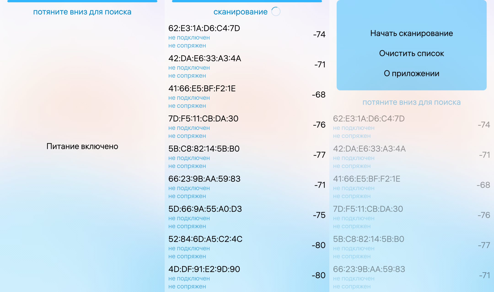

[**RU**](README.ru.md) | [EN](README.md)

---

# BLE-сканер

Проект демонстрирует работу с библиотекой SimpleBLE - кроссплатформенная библиотека для Bluetooth Low Energy (BLE), разработанная для простоты и удобства использования API BlueZ 5 DBus. В данном проекте реализованы и показаны возможности библиотеки по сканированию пространства. Вывод в формате списка найденных устройств, отображение их адресов и имен. Реализованы методы подключения к устройствам и вывод сервисов и характеристик включенных в сервисы.

Статус сборки:
1. example - 
2. dev - 

## Содержание

1. [Содержание](#Cодержание)
2. [Совместимость](#Совместимость)
3. [Особенности использования и сборки](#Особенности-использования-и-сборки)
4. [Информация о ветках](#Информация-о-ветках)
5. [Установка и запуск](#Установка-и-запуск)
6. [Скриншоты](#Скриншоты)
7. [Структура проекта](#Структура-проекта)
8. [Правила использования и участие в разработке](#Правила-использования-и-участие-в-разработке)

## Совместимость

Проект совместим со всеми текущими версиями ОС Аврора.

## Особенности использования и сборки

Данный пример-приложение собирается с помощью  Аврора SDK: [Документация](https://developer.auroraos.ru/doc/sdk/app_development/work/create/examples#build)

## Информация о ветках

[Ветки](https://developer.auroraos.ru/doc/software_development/examples#branches)

## Установка и запуск

Проект собирается обычным образом с помощью Аврора SDK: [Документация](https://developer.auroraos.ru/doc/sdk/app_development/work/build).

## Снимки экранов

## Структура проекта

Проект имеет стандартную структуру приложения на C++ и QML для ОС Аврора.

* Файл **[ru.auroraos.BleScanner.pro](ru.auroraos.BleScanner.pro)**
  описывает проект подкаталогов, который содержит два подпроекта, первый из которых отвечает за
  сборку библиотеки SimpleBLE, а второй описывает структуру приложения для
  системы сборки qmake.
* Каталог **[icons](app/icons)** содержит значки приложений для разных разрешений экрана.
* Каталог **[qml](app/qml)** содержит исходный код QML и ресурсы пользовательского интерфейса.
  * Каталог **[cover](app/qml/cover)** содержит реализации оболочек приложений.
  * Каталог **[icons](app/qml/icons)** содержит дополнительные иконки интерфейса пользователя.
  * Каталог **[pages](app/qml/pages)** содержит страницы приложения.
  * Файл **[BleScanner.qml](app/qml/BleScanner.qml)** обеспечивает реализацию окна приложения.
* Каталог **[rpm](rpm)** содержит настройки сборки rpm-пакета.
  Файл **[ru.auroraos.BleScanner.spec](rpm/ru.auroraos.BleScanner.spec)** используется инструментом rpmbuild.
* Каталог **[src](app/src)** содержит исходный код C++.
  * Файл **[main.cpp](app/src/main.cpp)** является точкой входа приложения.
* Каталог **[translations](app/translations)** содержит файлы перевода пользовательского интерфейса.
* Файл **[ru.auroraos.BleScanner.desktop](app/ru.auroraos.BleScanner.desktop)**
  определяет отображение и параметры запуска приложения.
  

## Правила использования и участие в разработке

Исходный код проекта предоставляется по [лицензии](LICENSE.BSD-3-CLAUSE.md),
которая позволяет использовать его в сторонних приложениях.

[Лицензионное соглашение с участником](https://gitlab.com/omprussia/wiki/-/wikis/CLA.ru)
[Соглашение участника](CONTRIBUTING.md) регламентирует права,
предоставляемые участниками компании «Открытая Мобильная Платформа».

Информация об участниках указана в файле [AUTHORS](AUTHORS.md).

[Кодекс поведения](CODE_OF_CONDUCT.md) — это действующий набор правил
компании «Открытая Мобильная Платформа»,
который информирует об ожиданиях по взаимодействию между членами сообщества при общении и работе над проектами.
